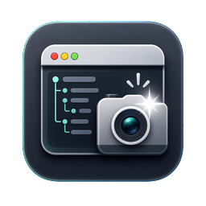
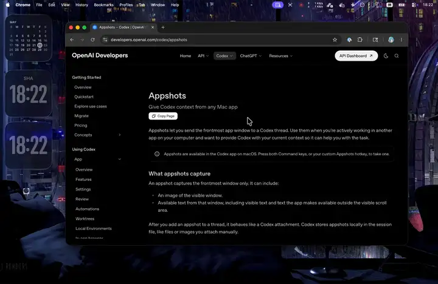

# Appshots

Appshots is a small macOS menu bar app for sending app context to coding agents. It captures the frontmost app window screenshot plus app state text generated by [`KWWKComputerUseCore`](https://github.com/EYHN/kwwk-computer-use-core), then copies an `[app-shots ...]` reference to your clipboard.

Inspired by [OpenAI Codex appshots](https://developers.openai.com/codex/appshots), this exists so Claude Code and other agents can get the same kind of visual + accessibility context on macOS.

Press left Option + right Option to capture the frontmost app, or use the menu bar popover.

  

